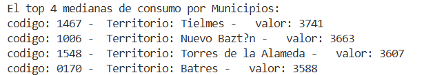

# Viviendas por intensidad de uso

En este proyecto extraeremos aquellos municipios con mayor consumo central eléctrico de la comunidad de Madrid durante el periodo 2021. 

## Tecnologías utilizadas 
**Visual Studio Code:** como entorno de desarrollo.  
**Java 17 y Java Development Kit openJDK:** herramienta para desarrollar en java incluye la JVM para ejecutar.

## Ejecución
En este proyecto trabajamos utilizando el arcihvo de tipo .csv que se encuentra en esta carpeta con el nombre "viviendas.csv".  
Tanto la cantidad de municipios, como el ingreso del archivo viviendas.csv debe ser ingresado por el usuario desde terminal de la siguiente manera:   
        
        javac .\Energia.java
        java .\Energia.java .\viviendas.csv 3

## Salida
Ejemplo de datos que obtendremos como salida:     

## Parte del código favorito  
Esta parte es mi preferida porque la API stream() crea un stream y no modifica la original, en este caso solo realiza un bucle foreach para leer el contenido de la lista, con un límite de repeticiones.      

        listaValorMunicipios.stream()
                    .limit(cant)
                    .forEach(m->System.out.printf("codigo: %s Territorio: %s  valor: %d \n",m.codigo, m.territorio, m.valor));

        