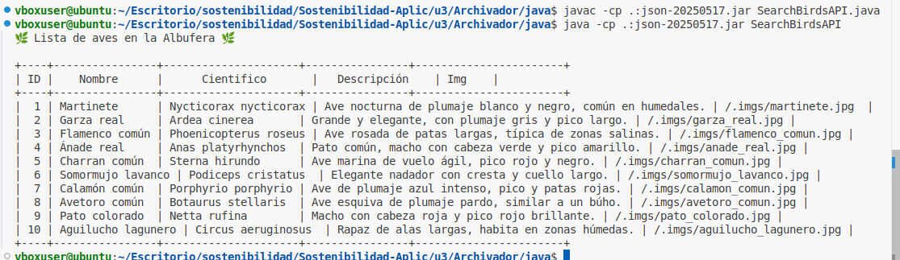
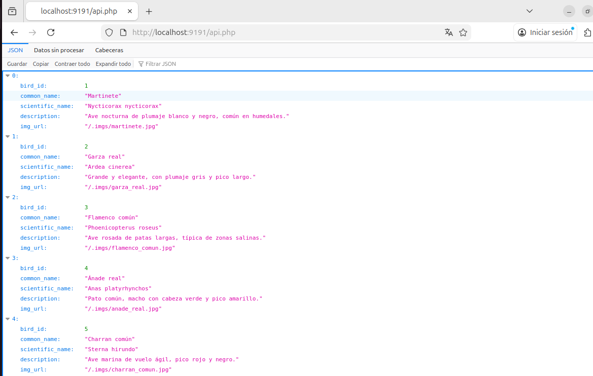
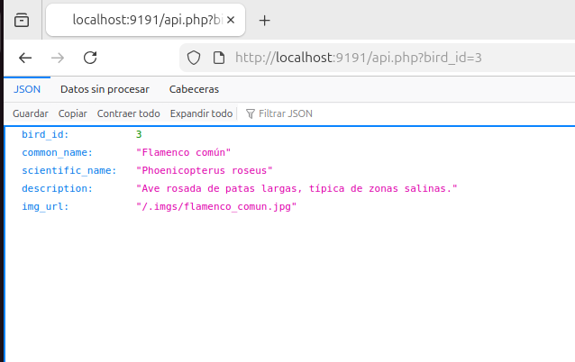

# Albuaves
Para lograr el funcionamiento de este programa hemos necesitado corregir algunos errores que surgen tanto previa a su ejecución como durante ésta. Algunos de ellos son en el comando a la hora de indicar el id del ave y otro error es la ruta de las imágenes de las aves dentro de la base de datos. 

## Tecnologías Necesarias  
* Java 
* SQLite3
* Sqlite Browser
* Librería org.json


## Ejecución  
Si no contamos con SQLite3 o SQLiteBrowser ejecutaremos el siguiente comando para su instalación.
```bash
sudo apt update; sudo apt install sqlitebrowser php-sqlite3
```
Una vez instalado todo podemos seguir con la eejecución, para ello tenemos que levantar la api, para ello ejecuta desde el directorio raíz el comando:
```
Archivador$ sh run-api-server.sh
```

Necesitaremos también compilar la extensión que contiene el paquete para la lectura del JSON, es por eso que primero debemos ejecutar los siguientes comandos desdes dentro de la carpeta java:  
```
../java$  
  javac -cp .:json-20250517.jar SearchBirdsAPI.java
  java -cp .:json-20250517.jar SearchBirdsAPI 
  ```
### Salida desde terminal
 

### Salida desde navegador 
Para esta salida únicamente debemos ingresar al siguiente link 
http://localhost:9191/api.php
 

### Salida de la búsqueda por id 

Para lograr esta salida debemos ingresar el id por la ruta de navegación. Ejemplo:  
`
api.php?bird_id=3
`

http://localhost:9191/api.php?bird_id=3

 
